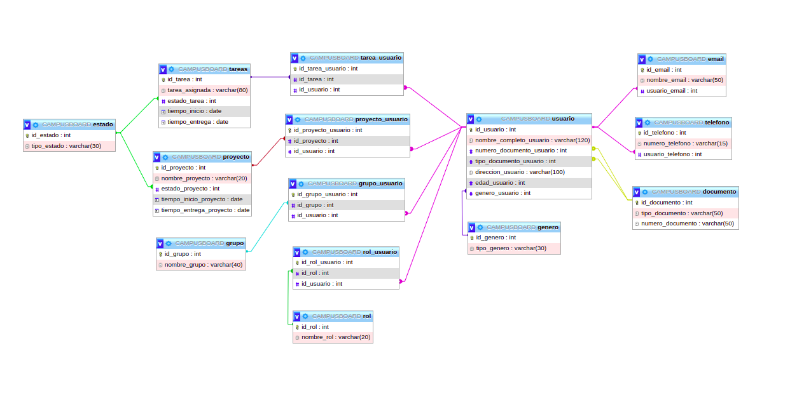

# CAMPUSBOARD

En este proyecto vamos a construir un Backend, para una aplicacion de asiganacion de tareas grupales, usuario(puede ser lider o participante)
con tiempos de inicio, tiempos de terminacion, grupos de trabajos, reasiganacion de tareas
y traslado de integrantes entre grupos

# OBJETIVOS ESPECIFICOS

CampusBoard, es una aplicacion de uso institucional, donde los campers podran entrenar la metodologia Scrum, mediante la creacion de proyectos por tareas tiempos definidos

# OBJETIVOS ESPECIFICOS

1. Organización de proyectos:
   - Los usuarios podrán crear proyectos dentro de la plataforma "CAMPUSBOARD".
   - Cada proyecto estará relacionado con un grupo.
   - Los lideres podrán asignar roles y permisos a los miembros del equipo dentro de cada proyecto.
2. Creación de tareas:
   - Dentro de cada proyecto, los usuarios podrán crear tareas individuales o en grupo para organizar el trabajo.
   - Las tareas podrán tener diferentes atributos, como nombre, asignación a un miembro del equipo, fecha de vencimiento, fecha de inicio, etc.
3. Gestión de tareas:
   - Los usuarios podrán ver todas las tareas asignadas a ellos en un panel personalizado.
   - Podrán actualizar el estado de las tareas (por ejemplo, "por hacer", "en progreso", "completada", etc.).
   - Será posible asignar comentarios y adjuntar archivos a las tareas para facilitar la comunicación y documentación.

# DISEÑO BASE DE DATOS



## Tecnologias Implementadas

<div>


</div> 

# Dependencias Implementadas

Express
express-session
class-transformer
reflect-metadata
mysql2
dotenv
nodemon
typescript

## Validacion De Token 

Con esta linea verificamos que el token en la url coincida con el que generamos, esto debido a la persistencia de cookies de la url

```
if (jwtData.payload.id && jwtData.payload.id !== req.params.id) {
        return res.sendStatus(403);
    }
```

# express-session

Express-session es un middleware de Express que proporciona un sistema de gestión de sesiones para las aplicaciones web. Las sesiones son un mecanismo que permite a los servidores web mantener información sobre el estado de un usuario entre diferentes solicitudes del cliente.

Cuando un cliente (navegador) se conecta a una aplicación web, el servidor web crea una sesión única para ese cliente. Esta sesión se identifica mediante un identificador único (un ID de sesión) que se envía al cliente en forma de cookie. En las solicitudes posteriores, el cliente incluirá este ID de sesión en las cabeceras de sus peticiones, lo que permite al servidor reconocer al cliente y mantener información específica relacionada con esa sesión.

Con esto eliminamos la persistencia que tenia la cookiees, que nos hacia tener que dar a buscar dos veces

# Instalacion

```
npm i -E -D express-session
```

#Configurar la sesión
```
Configurar la sesión
storageGenero.use(session({
    secret: 'mi-secreto',
    resave: false,
    saveUninitialized: true,   
}));
```

# express-query-boolean

Es una libreri que nos permite parsear los parámetros de consulta y luego definir cada tipo de consulta en una función separada.
Con este enfoque, cada tipo de consulta se maneja de manera separada en su propia función, lo que hace que el código sea más fácil de mantener y extender. Además, el uso de async/await y Promise permite manejar los errores de manera más efectiva

### instalacion

```
npm i -E -D express-query-boolean
```

## Definimos

Agregamos el middleware expressQueryBoolean para parsear los parámetros booleanos

```
storageTarea.use(expressQueryBoolean());
```

Función para obtener tareas por ID

```
const getTareaById = (id) => {
  return new Promise((resolve, reject) => {
    const sql = [`SELECT * FROM tareas WHERE id_tarea = ?`, id];
    con.query(...sql, (err, data) => {
      if (err) {
        reject(err);
      } else {
        resolve(data);
      }
    });
  });
};
```
Handler para la ruta de tareas
```
storageTarea.get("/", proxyTarea, async (req, res) => {
  try {
    if (req.query.id) {
      const data = await getTareaById(req.query.id);
      res.send(data);
    } else if (req.query.estado) {
      const data = await getTareaByEstado(req.query.estado);
      res.send(data);
    } else if (req.query.grupo) {
      const data = await getTareaByGrupo(req.query.grupo);
      res.send(data);
    } else {
      const sql = [`SELECT * FROM tareas`];
      con.query(...sql, (err, data) => {
        if (err) {
          console.error("Ocurrió un error intentando traer los datos de tareas", err.message);
          res.status(err.status || 500);
        } else {
          res.send(data);
        }
      });
    }
  } catch (err) {
    console.error("Ocurrió un error al procesar la solicitud", err.message);
    res.sendStatus(500);
  }
});
```

# Almacenar el JWT en la variable de sesión

```
req.session.jwt = jwt;
```

# Obtener el JWT de la variable de sesión

```
const jwt = req.session.jwt;
```

### Tiempo de expiracion de permanencia de la cookir

Con esto eliminamos el tiempo de persistencia de la cookie en el navegador, ademas del masAge, tambien podemos usar "expire". 
```
const maxAgeInSeconds = 3600;
        res.cookie('token', jwt, { httpOnly: true, maxAge: maxAgeInSeconds * 1000 });
```
# Funcion getBody(req)

Con esta funcion vamos a enviar los parametros obtenidos de jwt y pasar el cuerpo al metodo post, aca aplicamos ya la obttencion de la variable de sesion.

```
const getBody = async (req) =>{
    const jwt = req.session.jwt; 
    const encoder = new TextEncoder();  
    const jwtData = await jwtVerify( 
        jwt,
        encoder.encode(process.env.JWT_PRIVATE_KEY)
    );

    delete jwtData.payload.iat; 
    delete jwtData.payload.exp;   
    return jwtData.payload.body 
}
```

# CONSULTAS

## Estados

```
  "tipo_estado": "Pendiente
    "tipo_estado": "En progreso"
    "tipo_estado": "Completado"
    "tipo_estado": "Cancelado"
    "tipo_estado": "Revisión"
    "tipo_estado": "Aprobado"
    "tipo_estado": "Rechazado"
    "tipo_estado": "Entregado"
    "tipo_estado": "Suspendido"
    "tipo_estado": "Finalizado"
```

## Buscar tareas por id

```
http://127.9.63.30:5042/tareas?id=1
```

## Buscar tareas por estado pendientes
```
http://127.9.63.30:5042/tareas?estado=Pendiente

```

## Buscar tareas por grupo

```
http://127.9.63.30:5042/tareas?grupo=Grupo%20C //el %20 es por el espacio, si el nombre del grupo no tuviese espacio seria sin este

    "Grupo%20A",
    "Grupo%20B",
    "Grupo%20C",
    "Grupo%20D",
    "Grupo%20E",
    "Grupo%20F",
    "Grupo%20G",
    "Grupo%20H",
    "Grupo%20I",
    "Grupo%20J"
```
## Buscar numero de tareas por estado en cada grupo
```
http://127.9.63.30:5042/tareas?numTare=Pendiente

```

## Buscar tareas por estado en cada grupo
```
http://127.9.63.30:5042/tareas?numTareGrupo=Pendiente
```

